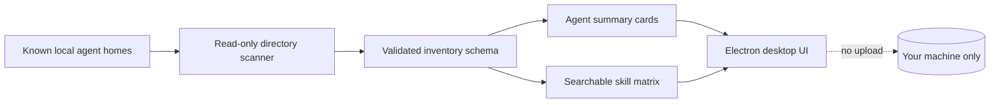

# Agent Sync Hub

<p align="center"><strong>One local view of skills across your coding agents.</strong><br>A privacy-first desktop inventory today; a safe synchronization control plane tomorrow.</p>

<p align="center">
  <a href="https://github.com/Semiconductor-AI/agent-sync-hub/releases/latest"></a>
  <a href="https://github.com/Semiconductor-AI/agent-sync-hub/actions/workflows/ci.yml"></a>
  <a href="LICENSE"></a>
  
</p>

<p align="center"><strong>English</strong> · <a href="README.zh-CN.md">简体中文</a></p>

## Why Agent Sync Hub?

Coding agents increasingly use the same building blocks—skills, MCP servers, hooks, and memory—but each runtime keeps them in a different directory and presents them differently. Before anything can be synchronized safely, you need a trustworthy answer to three questions:

1. Which agents are installed on this computer?
2. Which skills can each agent currently see?
3. What would change if synchronization were enabled later?

Agent Sync Hub starts with the first two. Version `0.1.x` is deliberately read-only: it discovers supported agent homes and creates an at-a-glance skill availability matrix without reading skill contents or modifying configuration.

## Highlights

- **One inventory across agents** — compare local skill availability without checking directories manually.
- **Local by default** — no account, cloud service, telemetry, or content upload.
- **Read-only foundation** — `0.1.x` never copies, deletes, or rewrites agent files.
- **Fast filtering** — find a skill and see which detected agents can access it.
- **English and Simplified Chinese** — follows the operating-system language and remembers manual selection.
- **Native desktop packages** — Windows x64/ARM64 and macOS Intel/Apple Silicon.
- **Security-conscious Electron shell** — context isolation, renderer sandbox, no Node integration, and a strict Content Security Policy.
- **Explicit failure behavior** — malformed scanner results surface as errors rather than silently becoming empty success states.

## Project status

Agent Sync Hub is an early public release. The distinction below is intentional and important:

| Capability | `v0.1.0` | Planned |
| --- | :---: | :---: |
| Detect supported local agent homes | ✅ | — |
| Index direct child skill directories | ✅ | — |
| Searchable cross-agent skill matrix | ✅ | — |
| Chinese / English desktop UI | ✅ | — |
| Read skill file contents | ❌ | Not required for inventory |
| MCP and hook inventory | — | `0.2` proposal |
| Dry-run synchronization plans | — | `0.3` proposal |
| Backup, validation, rollback, audit trail | — | `0.3` proposal |
| Signed installers and macOS notarization | — | `1.0` goal |

Roadmap entries are proposals, not promises. See [ROADMAP.md](ROADMAP.md) and join the discussion through Issues.

## Supported agents

The built-in `v0.1.0` registry recognizes these conventional home and skill locations:

| Agent | Home directory | Skills directory |
| --- | --- | --- |
| Claude Code | `~/.claude` | `~/.claude/skills` |
| Codex | `~/.codex` | `~/.codex/skills` |
| Shared Agents | `~/.agents` | `~/.agents/skills` |
| Qoder | `~/.qoder` | `~/.qoder/skills` |
| WorkBuddy | `~/.workbuddy` | `~/.workbuddy/skills` |

Detection means that the conventional home exists; it does not certify that a CLI is installed, authenticated, or currently running. Additional adapters should begin with a design Issue so platform paths and safety expectations can be reviewed.

## Download and install

Download the newest build from [GitHub Releases](https://github.com/Semiconductor-AI/agent-sync-hub/releases/latest).

| Platform | Package | Choose this when… |
| --- | --- | --- |
| Windows x64 | `Agent-Sync-Hub-*-Windows-x64.exe` | Most Intel/AMD Windows PCs |
| Windows ARM64 | `Agent-Sync-Hub-*-Windows-arm64.exe` | Windows on ARM devices |
| macOS Intel | `Agent-Sync-Hub-*-macOS-x64.dmg` or `.zip` | Intel-based Macs |
| macOS Apple Silicon | `Agent-Sync-Hub-*-macOS-arm64.dmg` or `.zip` | M1/M2/M3/M4 and later Apple chips |

These preview packages are not code-signed or notarized yet, so Windows SmartScreen or macOS Gatekeeper may show an unknown-developer warning. Only download builds from this repository's official Releases page and verify that the tag and workflow are visible before proceeding.

## Quick start

1. Install and open Agent Sync Hub.
2. Select **English** or **中文** in the header if you want to override the system language.
3. Choose **Scan this computer**.
4. Review detected agents, indexed skill counts, and the availability matrix.
5. Use the filter to locate a specific skill.

Scanning can be repeated while the app is open. It refreshes the inventory; `v0.1.0` does not watch directories continuously and does not change any agent runtime.

## How it works



The scanner checks known home directories and lists only direct child directories under each skills folder. Symbolic-link directories are ignored. The renderer receives a small inventory object through a narrow Electron preload bridge; it does not receive filesystem or Node.js access.

## Privacy and security boundary

Version `0.1.0`:

- reads directory existence and direct child directory names only;
- does not read skill files, prompts, conversations, API keys, or MCP configuration;
- does not upload inventory or use analytics;
- does not make network connections from the renderer;
- does not traverse symbolic-link directories;
- does not write to agent homes.

For the complete policy, see [PRIVACY.md](PRIVACY.md) and [SECURITY.md](SECURITY.md). Please use GitHub private vulnerability reporting for security issues rather than opening a public exploit report.

## Run from source

Requirements: [Node.js](https://nodejs.org/) 22 or newer and Git.

```bash
git clone https://github.com/Semiconductor-AI/agent-sync-hub.git
cd agent-sync-hub
npm ci
npm start
```

Run the automated tests and JavaScript syntax checks with `npm run check`. Create an unpacked development build with `npm run pack`. Platform installers are produced by the version-tag workflow on native GitHub-hosted runners.

## Troubleshooting

**An installed agent appears as “Not found.”**  
The current adapter checks the conventional home listed above. If your runtime uses a custom location, open an adapter proposal and include the OS and non-sensitive path pattern.

**A skill is missing from the matrix.**  
Only direct child directories are indexed. Files placed directly in a skills folder, nested catalogs, and symbolic links are intentionally excluded in this release.

**The installer shows a security warning.**  
The preview is unsigned. Confirm that it came from the official Release page. Signing and notarization are tracked for a later stable release.

**Does the app synchronize or delete anything?**  
No. The entire `0.1.x` line is read-only by design.

## Contributing

Useful contributions include platform testing, well-documented agent adapter proposals, Chinese or English copy and accessibility improvements, scanner failure-case tests, and review of the future synchronization threat model.

Read [CONTRIBUTING.md](CONTRIBUTING.md) before opening a pull request. Changes that introduce write behavior must document containment, ownership, backup format, validation, rollback, and partial-failure handling.

## Design references

The README information architecture was informed by established open-source agent and MCP projects including [Claude Code Router](https://github.com/musistudio/claude-code-router), [MCP Router](https://github.com/mcp-router/mcp-router), [Mission Control](https://github.com/builderz-labs/mission-control), [Claude Code Haha](https://github.com/NanmiCoder/cc-haha), and [AI Agent Skills](https://github.com/MoizIbnYousaf/Ai-Agent-Skills). Agent Sync Hub's wording, scope, implementation, and safety model are its own.

## License

Agent Sync Hub is available under the [MIT License](LICENSE). See [NOTICE](NOTICE) for attribution information.
