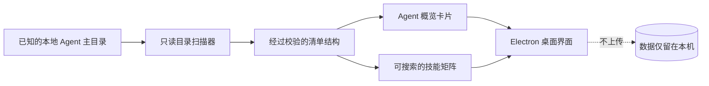

# Agent Sync Hub

<p align="center"><strong>在一个本地界面中看清各个编程 Agent 的技能。</strong><br>今天是注重隐私的桌面清单工具，未来将演进为安全的同步控制中心。</p>

<p align="center">
  <a href="https://github.com/Semiconductor-AI/agent-sync-hub/releases/latest"></a>
  <a href="https://github.com/Semiconductor-AI/agent-sync-hub/actions/workflows/ci.yml"></a>
  <a href="LICENSE"></a>
  
  <a href="https://openai.com/codex/"></a>
</p>

<p align="center"><a href="README.md">English</a> · <strong>简体中文</strong></p>

## 为什么需要 Agent Sync Hub？

越来越多编程 Agent 开始使用相同的能力组件——Skills、MCP 服务、Hooks 与记忆——但不同运行时把它们放在不同目录，也使用不同方式展示。在安全同步任何内容之前，至少应该先可靠地回答三个问题：

1. 这台电脑安装了哪些 Agent？
2. 每个 Agent 当前能看到哪些技能？
3. 如果以后开启同步，究竟会发生哪些变化？

Agent Sync Hub 从前两个问题入手。`0.1.x` 版本刻意保持只读：它发现受支持的 Agent 主目录，生成一目了然的技能可用性矩阵，不读取技能内容，也不修改任何配置。

## 核心亮点

- **统一清单**：无需逐个翻找目录，即可比较多个 Agent 的本地技能。
- **本地优先**：不需要账号、云服务或遥测，也不上传内容。
- **只读基础**：`0.1.x` 不复制、不删除、不重写 Agent 文件。
- **快速筛选**：搜索技能名称，立即查看哪些 Agent 可以访问它。
- **中英文界面**：自动跟随系统语言，也会记住手动选择。
- **桌面安装包**：覆盖 Windows x64/ARM64、macOS Intel/Apple Silicon。
- **安全的 Electron 边界**：上下文隔离、渲染进程沙箱、禁用 Node 集成，并配置严格 CSP。
- **错误明确可见**：扫描结果异常时直接报错，不会把空对象静默伪装为成功。

## 项目当前状态

Agent Sync Hub 仍处于公开早期版本。下表明确区分“已经实现”和“计划探索”的能力：

| 能力 | `v0.1.0` | 后续规划 |
| --- | :---: | :---: |
| 发现受支持的本地 Agent 主目录 | ✅ | — |
| 索引技能目录的直接子目录 | ✅ | — |
| 可搜索的跨 Agent 技能矩阵 | ✅ | — |
| 中文 / 英文桌面界面 | ✅ | — |
| 读取技能文件内容 | ❌ | 清单功能无需读取 |
| MCP 与 Hook 清单 | — | `0.2` 提案 |
| 同步变更预演（dry run） | — | `0.3` 提案 |
| 备份、校验、回滚与审计记录 | — | `0.3` 提案 |
| 安装包签名与 macOS 公证 | — | `1.0` 目标 |

路线图是提案，不是承诺。详见 [ROADMAP.md](ROADMAP.md)，也欢迎通过 Issues 参与讨论。

## 支持的 Agent

`v0.1.0` 内置注册表识别以下约定目录：

| Agent | 主目录 | 技能目录 |
| --- | --- | --- |
| Claude Code | `~/.claude` | `~/.claude/skills` |
| Codex | `~/.codex` | `~/.codex/skills` |
| Shared Agents | `~/.agents` | `~/.agents/skills` |
| Qoder | `~/.qoder` | `~/.qoder/skills` |
| WorkBuddy | `~/.workbuddy` | `~/.workbuddy/skills` |

“已发现”只代表约定主目录存在，并不证明相应 CLI 已正确安装、登录或正在运行。新增适配器前建议先提交设计 Issue，以便共同审核不同平台路径与安全边界。

## 下载与安装

请从 [GitHub Releases](https://github.com/Semiconductor-AI/agent-sync-hub/releases/latest) 下载最新版本。

| 平台 | 安装包 | 适用设备 |
| --- | --- | --- |
| Windows x64 | `Agent-Sync-Hub-*-Windows-x64.exe` | 大多数 Intel/AMD Windows 电脑 |
| Windows ARM64 | `Agent-Sync-Hub-*-Windows-arm64.exe` | Windows on ARM 设备 |
| macOS Intel | `Agent-Sync-Hub-*-macOS-x64.dmg` 或 `.zip` | Intel 芯片 Mac |
| macOS Apple Silicon | `Agent-Sync-Hub-*-macOS-arm64.dmg` 或 `.zip` | M1/M2/M3/M4 及后续 Apple 芯片 |

当前预览安装包尚未完成代码签名和 Apple 公证，因此 Windows SmartScreen 或 macOS Gatekeeper 可能显示“未知开发者”提醒。请只从本仓库官方 Releases 页面下载，并在运行前确认版本标签和构建流程均公开可见。

## 快速开始

1. 安装并打开 Agent Sync Hub。
2. 如需覆盖系统语言，在顶部选择 **中文** 或 **English**。
3. 点击 **扫描此电脑**。
4. 查看已发现的 Agent、技能数量以及可用性矩阵。
5. 使用筛选框快速定位某项技能。

应用保持打开时可以反复扫描并刷新清单。`v0.1.0` 尚不持续监听目录，也不会改变任何 Agent 的运行状态。

## 工作原理



扫描器检查已知主目录，仅列出各技能目录的直接子目录，并忽略符号链接目录。渲染进程通过收窄的 Electron preload 桥接接收一份小型清单对象，不获得文件系统或 Node.js 访问能力。

## 隐私与安全边界

`v0.1.0`：

- 只读取目录是否存在以及直接子目录名称；
- 不读取技能文件、提示词、对话、API 密钥或 MCP 配置；
- 不上传清单，也不使用分析遥测；
- 渲染进程不发起网络连接；
- 不遍历符号链接目录；
- 不向 Agent 主目录写入内容。

完整说明见 [PRIVACY.md](PRIVACY.md) 与 [SECURITY.md](SECURITY.md)。安全漏洞请使用 GitHub 私密漏洞报告功能，不要公开发布尚未修复的利用细节。

## 从源码运行

需要 [Node.js](https://nodejs.org/) 22 或更高版本以及 Git。

```bash
git clone https://github.com/Semiconductor-AI/agent-sync-hub.git
cd agent-sync-hub
npm ci
npm start
```

使用 `npm run check` 运行自动化测试和语法检查；使用 `npm run pack` 创建未封装的开发构建。正式安装包由版本标签工作流在对应的 GitHub 托管运行器上生成。

## 常见问题

**已经安装的 Agent 为什么显示“未发现”？**  
当前适配器只检查上表中的约定主目录。如果你的运行时使用自定义位置，请提交适配器提案，并提供操作系统及不含隐私信息的路径规则。

**为什么某项技能没有出现在矩阵中？**  
当前只索引技能目录的直接子目录。直接放置的文件、更深层级的目录和符号链接会被刻意忽略。

**安装时为什么出现安全提醒？**  
预览版本尚未签名。请确认文件来自官方 Release 页面。签名和 Apple 公证已列入后续稳定版本规划。

**它会同步或删除文件吗？**  
不会。整个 `0.1.x` 系列按设计都是只读的。

## 参与贡献

有价值的贡献包括：跨平台安装包测试、文档完整的 Agent 适配方案、中英文文案与无障碍改进、扫描器安全失败测试，以及未来同步功能的威胁模型评审。

提交 Pull Request 前请阅读 [CONTRIBUTING.md](CONTRIBUTING.md)。任何引入写入行为的变更，都必须说明路径约束、所有权、备份格式、校验、回滚和部分失败处理方案。

## 设计参考

README 的信息架构参考了成熟的开源 Agent 与 MCP 项目，包括 [Claude Code Router](https://github.com/musistudio/claude-code-router)、[MCP Router](https://github.com/mcp-router/mcp-router)、[Mission Control](https://github.com/builderz-labs/mission-control)、[Claude Code Haha](https://github.com/NanmiCoder/cc-haha) 与 [AI Agent Skills](https://github.com/MoizIbnYousaf/Ai-Agent-Skills)。Agent Sync Hub 的文字、功能边界、实现与安全模型均为独立设计。

## 使用 OpenAI Codex 构建

Agent Sync Hub 在 `Semiconductor-AI` 维护者的指导与审核下，使用 [OpenAI Codex](https://openai.com/codex/) 辅助完成了架构设计、代码实现、测试、文档、安装包构建与项目发布。Codex 是本项目使用的开发 Agent 和协作工具。

这段说明仅用于如实描述项目的开发方式，并不表示 OpenAI 官方赞助、认可、维护本项目或为本项目提供支持。OpenAI 与 Codex 商标归其各自权利人所有。

## 许可证

Agent Sync Hub 使用 [MIT 许可证](LICENSE)，归属信息见 [NOTICE](NOTICE)。
